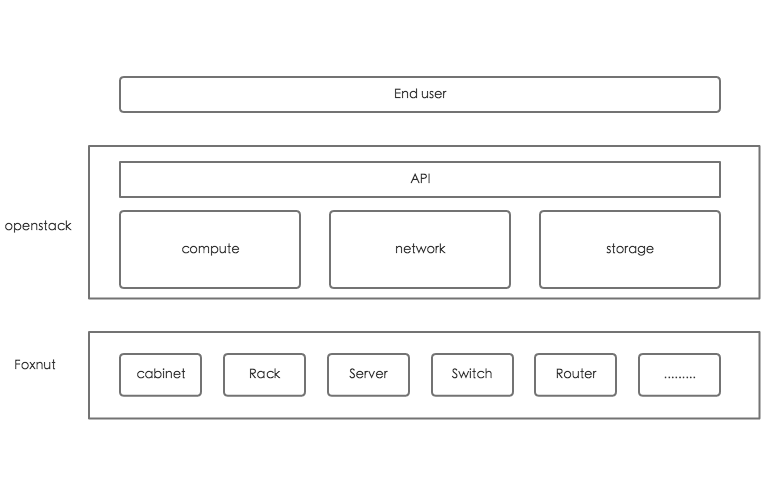

# Foxnut Overview

Foxnut is a service to manage infrastructure under OpenStack, which including
datacenter, rack, network devices, servers, interfaces, disks, etc. devices,
Foxnut provides an OpenStack-native REST API and will contain comand line tool
and web-based visualization interface.

# Why Foxnut, Why us

As a cloud infrastructure software, OpenStack has hidden the complexity of
hardwares for end users. But to cloud operators, they have to face different
hardwares under OpenStack, such as: racks, servers, interfaces, fibers, etc.

As a DevOps team of OpenStack service provider, we have deliverd more than
one hundred OpenStack clusters for users, the preparatory work is repeated and
complicated, it takes lots of time on checking the correctness of links and
location of servers, when complexity grow exponentially with the grow of clusters
scale and availability.

Foxnut is aim to manage these hardware efficiently, it's designed to collect
hardware information and organize them in visualization, operators can choose
different OpenStack architecture and foxnut will generate automatically rack view
and networking connections view. It also will display hardwares status
in real-time. With foxnut's help, operators could install servers into a rack and
cable the server quickly and easily.

## Getting Started

If you'd like to run from the master branch, you can clone the git repo:

    git clone https://git.openstack.org/openstack/foxnut

* Free software: Apache license
* Documentation: http://docs.openstack.org/developer/foxnut
* Source: http://git.openstack.org/cgit/openstack/foxnut
* Bugs: http://bugs.launchpad.net/foxnut

## License

Apache License Version 2.0 http://www.apache.org/licenses/LICENSE-2.0
